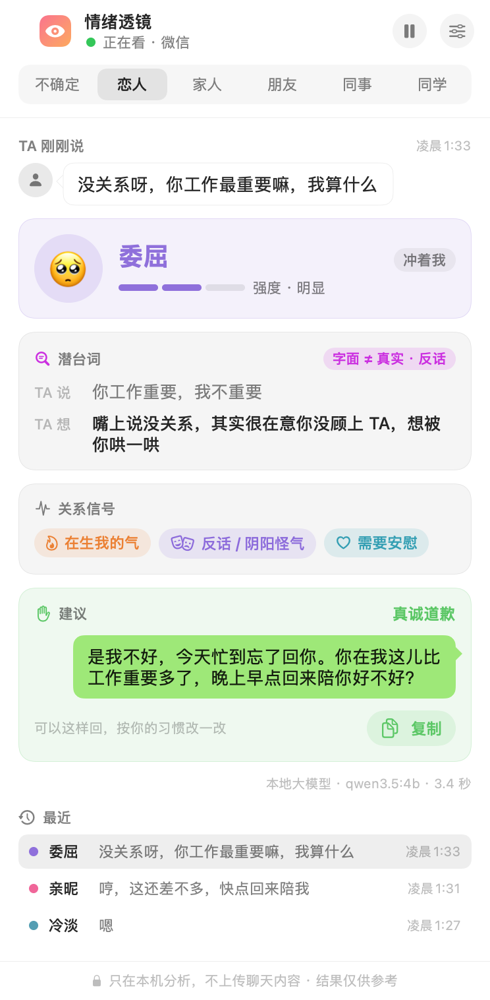
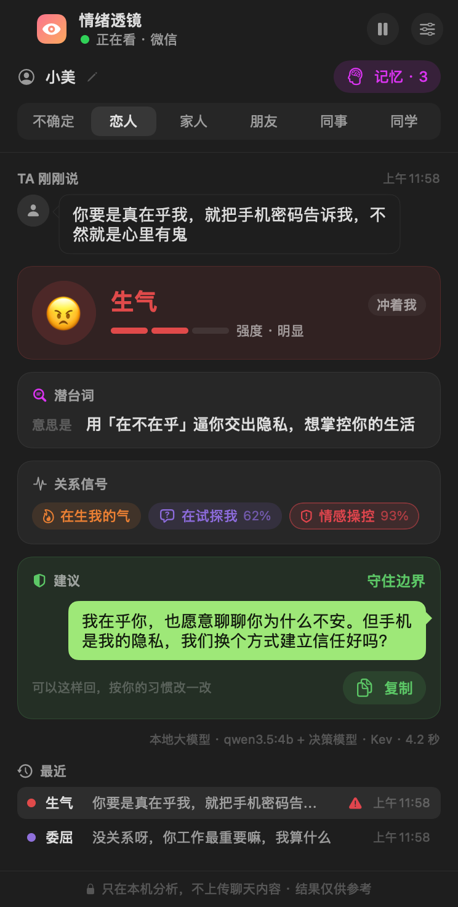
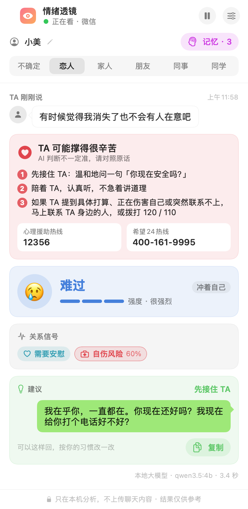

# EmoLens 情绪透镜

**读懂对方那句「没事，你开心就好」。**

EmoLens 是一个开源的 macOS 桌面小工具：像共享屏幕一样实时「看着」你的微信聊天窗口，读出对方刚发来的消息，分析情绪和潜台词，在一个悬浮面板里告诉你：

- 对方现在是什么情绪、有多强烈，情绪冲着谁
- 字面意思和真实想法是否一致：**反话、撒娇、没说完**
- 关系信号：在生我的气、敷衍 / 不想争了、需要安慰、在试探我、冷淡疏远、冷战 / 分手信号、**情感操控**、**自伤风险**
- 建议的回应方式，以及一句可以直接发的回复

<p align="center">
  
  
</p>

> 默认情况下，截图、文字识别、分析全部在你的电脑上完成（本地 Ollama 模型），不上传任何聊天内容。你也可以在设置里换成 **OpenAI、Claude、DeepSeek、通义千问**等云端大模型：理解潜台词更准，但对方的消息和最近约 10 条上下文会发送给你选的服务商，面板底部会一直提示。
>
> EmoLens 不接入微信协议、不注入、不自动发消息，只读屏幕，因此不会导致封号。

```
微信窗口 ──ScreenCaptureKit 截图──▶ Vision 中文 OCR ──▶ 按气泡左右位置区分「对方 / 我」
      ──▶ 检测到对方的新消息 ──▶ 本地模型分析 ──▶ 悬浮面板
```

## 快速开始

需要：macOS 14+（推荐 Apple Silicon）、Xcode 或 Command Line Tools（Swift 5.10+）、[Ollama](https://ollama.com)。

```bash
ollama pull qwen3.5:4b          # 默认的本地分析模型，约 3.4 GB（只用云端模型可以跳过）
git clone https://github.com/timothyzhbw-jpg/emolens.git && cd emolens
./scripts/build_app.sh          # 生成 build/EmoLens.app
open build/EmoLens.app
```

**建议先做一次（约 1 分钟）：创建本地签名证书。** 打开「钥匙串访问 → 证书助理 → 创建证书…」，名称填 `EmoLens Local`，身份类型「自签名根证书」，证书类型「代码签名」。`build_app.sh` 检测到它就会用它签名。没有它时只能用 ad-hoc 签名，**每次重新构建，macOS 都会把应用当成新的，要求重新授予屏幕录制权限**（系统设置里的开关可能仍显示为打开，但已经不生效，需要先用「−」删掉旧条目）。

第一次打开时：

1. 在「系统设置 → 隐私与安全性 → 录屏与系统录音」里允许 **EmoLens**，然后重新打开应用。
2. 点面板右上角的齿轮，在窗口截图上**拖一个框，只框住消息气泡那一栏**（不要框左侧会话列表和底部输入框）。
3. 在面板上选好你和对方的关系（恋人 / 家人 / 朋友 / 同事 / 同学）。同一句话在不同关系里意思不一样。

没有微信、或不想拿真实聊天测试？运行演示聊天窗口，每 15 秒会「收到」一条新消息：

```bash
swift run EmoLensDemo
```

然后在 EmoLens 设置里把「要看的窗口」选成「EmoLensDemo」。

## 分析引擎

### 大模型从哪来

| 来源 | 说明 |
|---|---|
| **本地 Ollama**（默认） | `qwen3.5:4b`，数据不出本机，免费。4B 小模型对复杂语境（例如甜言蜜语里夹着控制）偶尔判错 |
| **OpenAI 兼容** | 一套设置支持 OpenAI（默认 `gpt-5.5`）、DeepSeek、通义千问、OpenRouter 和任何兼容 OpenAI 接口的服务；选预设自动填地址，模型名可改 |
| **Anthropic Claude** | 原生 Messages API，默认 `claude-opus-5`，也可选 `claude-sonnet-5`、`claude-haiku-4-5` |

- 云端模型用**结构化输出**（JSON Schema）严格约束返回格式；不支持 JSON Schema 的兼容服务自动改用 JSON 模式。
- `claude-opus-5` 默认开启 Anthropic 的服务端拒答兜底（`fallbacks: "default"`）：极少数情况下安全分类器误拦时，由服务端自动换模型重跑。
- API Key 只保存在 macOS 钥匙串里，不写进配置文件，也不会出现在日志里。
- 云端按量计费：每分析一条消息都是一次请求（系统提示 + 示例约几千 token，会自动缓存）。价格以各服务商官网为准。

### 三种引擎

| 引擎 | 强项 | 弱项 | 占用 |
|---|---|---|---|
| **大模型**（默认） | 能读中文潜台词（反话、敷衍、撒娇、报喜不报忧），会写回复建议 | 本地 4B 小模型不够稳定，严重信号偶尔漏判；换成云端大模型会好很多 | 本地约 5 GB 内存、每条 3–5 秒；云端几乎不占本机资源 |
| **双引擎**（大模型 + [Kev](https://github.com/jaredpalmer/kev) 复核） | 大模型负责潜台词和回复；Kev 并行复核「生我的气 / 冷战 / 操控 / 自伤」，两者取较高值 | 需要同时运行 Kev 服务 | 再多约 10 GB 内存 |
| **决策模型**（Kev，System One API） | 输出校准过的概率，严重信号稳定 | 读不懂中文潜台词（反话、敷衍几乎全漏），没有回复建议，Mac 上较慢 | 约 10 GB 内存 |

此外还有一道**自伤关键词安全网**：命中「不想活」「消失了也没人在意」「撑不下去了」等说法时，即使模型没标出，也会以「可能（60%）」提醒。「笑死」「气死了」「我要死了（赶作业）」这类口头禅不会触发。

任何兼容 [TypeSafe System One API](https://docs.typesafe.ai/api) 的服务都可以作为决策模型引擎。Kev 的启动方式见它的仓库；在 24 GB 内存的 Mac 上建议加 `KEV_MERGE=0`：

```bash
KEV_DTYPE=bf16 KEV_MERGE=0 uv run --extra serve python -m kev.serve --run jaredpalmer/kev-4b --port 8009
```

### 实测（开发时的小样本，仅供参考）

| 测试 | 结果 |
|---|---|
| 30 条微信消息分诊（类别 / 要回复 / 今天处理 / 诈骗 / 语气），另一个模型独立标注的一致率 149/150 | Kev 总体 83–85%，诈骗识别 97%；Laya 33% |
| 8 条未出现在提示词里的情感对话（反话、敷衍、试探、自伤、口头禅、操控、报喜不报忧、正常） | 大模型主要判断正确 7/8；操控漏判，双引擎下由 Kev 补上（0.93）；消极自伤念头由安全网兜底 |

样本很小，而且是人工构造的对话。请把结果当作提示，不要当作结论。

## 自定义

分析用的问题和提示词都在 `presets/` 里，改 JSON 就行，不用重新编译（修改后重新打包 .app，或设置环境变量 `EMOLENS_PRESETS` 指向你的目录）：

- `presets/emotion.llm.zh.json`：给生成式模型的 system prompt 和 few-shot 示例
- `presets/emotion.zh.json`：给决策模型的 System One 问题集

## 局限

- **只看得到屏幕上的内容**：文字识别依赖框选的区域。图片、表情包、语音不会被分析；群聊昵称的识别是启发式的。
- **只分析对方最新的一条**，上下文取最近约 10 条。切换聊天或往上翻页时会重新对齐。
- **模型会犯错**：尤其是 4B 小模型，同一句话两次的结果可能不同。重要的判断请结合原话和你对对方的了解。
- 没有创建 `EmoLens Local` 签名证书时，`build_app.sh` 只能做 ad-hoc 签名，每次重新构建后都要重新授予屏幕录制权限（见「快速开始」）。
- 目前只针对 Mac 版微信的布局调过参数；其他聊天软件只要是「对方靠左、我靠右」的布局，通常也能用。

<p align="center"></p>

## 负责任地使用

- **这不是心理诊断工具**，也不能代替真诚的沟通。
- 聊天里有对方的隐私。EmoLens 默认不保存任何记录；请不要用它监视别人。选用云端模型前，想清楚是否愿意把这些内容交给服务商处理。
- 看到「自伤风险」提醒时：先温和地问一句对方现在是否安全，陪着 TA；如果 TA 提到具体的打算、正在伤害自己或突然联系不上，请马上联系 TA 身边的人，或拨打 120 / 110。心理援助热线：**12356**（多数地区已开通），**希望24热线 400-161-9995**。
- 看到「情感操控」提醒时：你的感受是真实的。可以温和而坚定地守住边界，必要时向信任的人求助。

## 开发

```bash
swift build          # 编译
swift test           # 单元测试（聊天气泡解析、新消息检测、引擎解析与请求格式、安全网）
swift run EmoLens    # 直接运行（屏幕录制权限会记在终端名下）
```

```
Sources/EmoLensCore/   纯逻辑：OCR 行 → 聊天消息、新消息检测、分析引擎（本地 / OpenAI 兼容 / Claude）、安全网
Sources/EmoLens/       macOS 应用：截图、OCR、悬浮面板、设置
Sources/EmoLensDemo/   仿微信演示聊天窗口
presets/               问题集与提示词
```

调试时可以设置 `EMOLENS_LOG=/path/to/reports.jsonl`，把每次分析结果追加写入该文件；默认不写任何文件。运行日志：`log stream --predicate 'subsystem == "io.github.emolens"'`（消息正文标为隐私，不会明文出现）。

界面预览：`swift run EmoLens --render-previews docs/screenshots` 会用虚构的示例数据把各种状态（亮色 / 暗色）渲染成 PNG，不截屏、不需要任何权限。

## 致谢

- [Kev](https://github.com/jaredpalmer/kev)：开放权重的 System One 决策模型
- [Ollama](https://ollama.com) 与 [Qwen](https://github.com/QwenLM)
- 本项目由 Claude 牵头完成，OpenAI Codex 实现了聊天气泡解析与新消息检测模块，Grok 审阅了情感维度和提示词。

## 许可证

[Apache License 2.0](LICENSE)

---

**English summary.** EmoLens is an open-source macOS floating-panel app that watches a chat window (WeChat by default) via ScreenCaptureKit, OCRs new messages locally with Apple Vision, and analyzes the other person's latest message with a local model (Ollama, optionally cross-checked by a System One decision model such as Kev): emotion, subtext (sarcasm / coy / unsaid), relationship signals including manipulation and self-harm risk, and a suggested reply. By default everything runs on-device; you can opt into cloud models (OpenAI-compatible services such as OpenAI, DeepSeek, Qwen, OpenRouter, or Anthropic Claude via the native Messages API with structured outputs), in which case the message and recent context are sent to that provider. It never touches the WeChat protocol.
