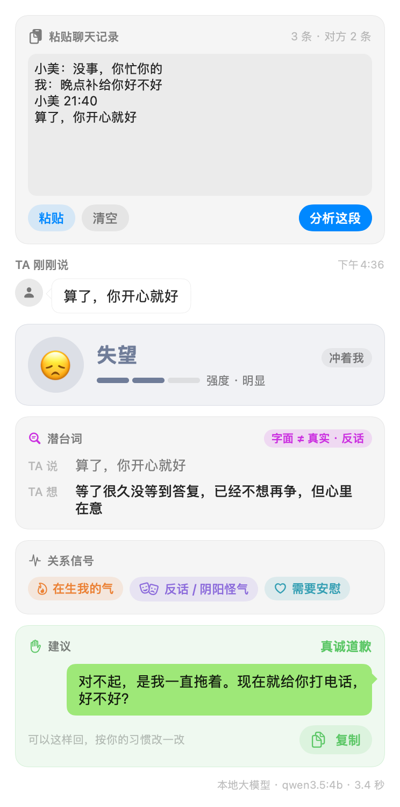
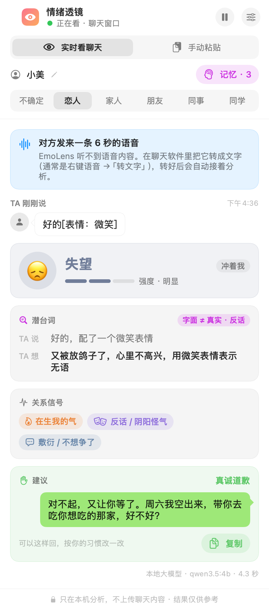
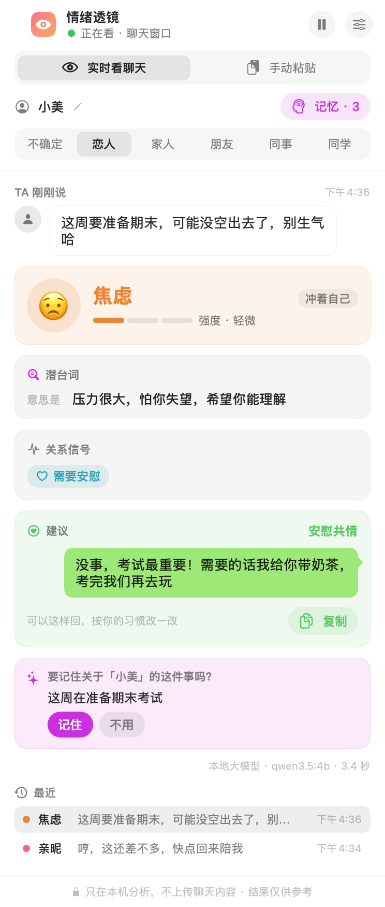

# EmoLens 情绪透镜

**读懂对方那句「没事，你开心就好」。**

EmoLens 是一个开源的 macOS 桌面小工具：像共享屏幕一样实时「看着」你的即时通讯聊天窗口，读出对方刚发来的消息，分析情绪和潜台词，在一个悬浮面板里告诉你：

- 对方现在是什么情绪、有多强烈，情绪冲着谁
- 字面意思和真实想法是否一致：**反话、撒娇、没说完**
- 关系信号：在生我的气、敷衍 / 不想争了、需要安慰、在试探我、冷淡疏远、冷战 / 分手信号、**情感操控**、**自伤风险**、**涉及钱或账号**
- 建议的回应方式，以及一句可以直接发的回复
- **记得每个人**：认出正在和谁聊，参考你们过去的情绪走势和你记下的事（「她在准备考研」「别说她想多了」），判断更贴合你们的情况

<p align="center">
  
  
</p>

> 默认情况下，截图、文字识别、分析全部在你的电脑上完成（本地 Ollama 模型），不上传任何聊天内容。你也可以在设置里换成 **OpenAI、Claude、DeepSeek、通义千问**等云端大模型：理解潜台词更准，但对方的消息和最近约 10 条上下文会发送给你选的服务商，面板底部会一直提示。
>
> EmoLens 不接入任何聊天软件的协议、不注入、不自动发消息，只读屏幕，因此不会导致封号。

```
聊天窗口 ──ScreenCaptureKit 截图──▶ Vision 中文 OCR ──▶ 按气泡左右位置区分「对方 / 我」
      ──▶ 检测到对方的新消息 ──▶ 本地模型分析 ──▶ 悬浮面板
```

## 快速开始

需要：macOS 14 及以上；本地分析需要 [Ollama](https://ollama.com)（只用云端模型可以不装）。

### 下载安装（推荐）

1. 到 [Releases](https://github.com/timothyzhbw-jpg/emolens/releases/latest) 下载 `EmoLens-x.y.z.dmg`，打开后把 **EmoLens** 拖进「应用程序」。安装包同时包含 Apple 芯片和 Intel 版本（Intel 版还没在真机上测过，遇到问题欢迎提 issue）。
2. 下载本地分析模型（约 3.4 GB）。不用手动 `ollama serve`，EmoLens 会自己启动：

   ```bash
   ollama pull qwen3.5:4b
   ```

3. **第一次打开会被 macOS 拦下**：EmoLens 是个人开源项目，没有付费的 Apple 开发者签名和公证，系统会提示「无法验证开发者」。点「完成」，然后到「系统设置 → 隐私与安全性」，在页面下方点「仍要打开」。也可以在终端里执行一次：

   ```bash
   xattr -dr com.apple.quarantine /Applications/EmoLens.app
   ```

   不放心的话，可以按下面的步骤自己从源码构建。

### 从源码构建

另外需要 Xcode 或 Command Line Tools（Swift 5.10+）。

```bash
ollama pull qwen3.5:4b          # 默认的本地分析模型（只用云端模型可以跳过）
git clone https://github.com/timothyzhbw-jpg/emolens.git && cd emolens
./scripts/build_app.sh          # 生成 build/EmoLens.app
open build/EmoLens.app
```

**建议先做一次（约 1 分钟）：创建本地签名证书。** 打开「钥匙串访问 → 证书助理 → 创建证书…」，名称填 `EmoLens Local`，身份类型「自签名根证书」，证书类型「代码签名」。`build_app.sh` 检测到它就会用它签名。没有它时只能用 ad-hoc 签名，**每次重新构建，macOS 都会把应用当成新的，要求重新授予屏幕录制权限**（系统设置里的开关可能仍显示为打开，但已经不生效，需要先用「−」删掉旧条目）。

### 用起来

打开后面板会浮在最上层，切换桌面空间、或别的应用全屏时都会跟着走；菜单栏也有一个眼睛图标，可以随时把面板叫回来或暂停监控。

用本地模型时不用先开终端：**EmoLens 会自己启动 Ollama**（只对本机地址生效，可在设置里关闭），并在后台先把模型加载好，所以第一条消息也不用等冷启动（开发用的 Apple 芯片 Mac 上实测：约 4 秒，冷启动要 11.7 秒）。本地起不来时会如实报错并告诉你怎么办，**绝不会自动改用云端模型**——聊天内容要不要发出去只能由你决定。

第一次打开时：

1. 在「系统设置 → 隐私与安全性 → 录屏与系统录音」里允许 **EmoLens**，然后重新打开应用。
2. 点面板右上角的齿轮，在窗口截图上**拖一个框，只框住消息气泡那一栏**（不要框左侧会话列表和底部输入框）。
3. 在面板上选好你和对方的关系（恋人 / 家人 / 朋友 / 同事 / 同学）。同一句话在不同关系里意思不一样。

不想拿真实聊天测试？运行演示聊天窗口，每 15 秒会「收到」一条新消息：

```bash
swift run EmoLensDemo
```

然后在 EmoLens 设置里把「要看的窗口」选成「EmoLensDemo」。

## 两种用法：实时看屏幕，或手动粘贴

<p align="center"></p>

面板顶部可以切换：

- **实时看聊天**：像共享屏幕一样盯着聊天窗口，对方一发消息就自动分析。
- **手动粘贴**：在聊天软件里选中几条消息复制，粘到面板里点「分析这段」。不截屏、不需要屏幕录制权限，也不用开着聊天软件——在手机上截的对话、别人转述的聊天记录都能分析。支持「小美：内容」和「小美 12:30」换行两种格式，认不出名字的行算作对方说的；一段里出现多个人时可以选谁是「对方」。

## 表情、表情包和语音

对方不一定打字。EmoLens 除了读字，还会从截图的像素里把每个气泡、表情包和头像找出来，所以这些也认得出：

| 对方发的 | EmoLens 看到的 |
|---|---|
| 文字里夹着表情「好的🙂」 | `好的[表情：微笑]`：先把表情涂掉再认字（挨着表情的字最容易认错），再把表情单独截下来、放大，交给模型看是什么表情 |
| 只发一个表情、一个表情包 | `[表情：捂脸]`、`[表情包：猫咪捂耳朵，写着「我不听」]`：以前这种消息 OCR 读不到字，整条会被漏掉 |
| 语音，已经转成了文字 | `[语音转文字] 那你到底几点回来`：按转出来的文字分析，同时告诉模型这是语音转的，可能有错字 |
| 语音，还没转文字 | 面板提示「对方发来一条 6 秒的语音」。在聊天软件里把它转成文字（通常是右键语音 →「转文字」），转好后自动接着分析 |
| 引用回复 | `那你几点回（引用：我：今晚加班）`：引用框不再被当成对方的新消息 |

<p align="center"></p>

看表情用的是分析时的同一个模型：默认的 `qwen3.5:4b` 本身能看图，每个表情多花约 0.7 秒，看过的会记住。模型不支持看图（比如 DeepSeek）时自动跳过，按 `[表情]` 分析。设置里可以关掉「看懂表情和表情包」。

聊天表情有自己的「潜规则」：「微笑」常常是无语或阴阳怪气，「捂脸」是尴尬，「旺柴」是开玩笑。聊天里出现表情或语音时，这些说明会附在给模型的消息后面；纯文字的聊天不附，分析和以前完全一样。

排查识别问题：`EmoLens --inspect 截图.png` 会打印 OCR 结果、认出的气泡和拼好的消息；加 `--analyze` 再跑一遍看图和分析。截图只在本机处理。

## 联系人记忆

<p align="center"></p>

EmoLens 会读聊天窗口顶部的名字，认出正在和谁聊（认错了可以在面板上改），并为每个人单独记住：

- **你记下的事**：在「记忆」里随手记，比如近况、喜好、雷区、重要日子。
- **AI 建议记住的事**：对方透露了具体的日子、计划、身体状况或喜好时（「下周三面试」「对虾过敏」），面板会问「要记住吗？」——**只有你点「记住」才会写进去**。
- **情绪走势**：自动累计最近的情绪和关系信号（原话只留前 40 字）。
- **每个人自己的关系**：小美是恋人、王经理是同事，切换聊天时自动切换。

分析时，EmoLens 把这个人的记忆摘要作为背景一起交给模型，并提醒模型「以这次的原话为准」。记忆只存在本机 `~/Library/Application Support/EmoLens/memory.json`（仅你自己可读），可以按人删除或一键清空，也可以在设置里关掉「参考记忆」或「自动记录」。用云端模型时，当前联系人的记忆摘要会随分析一起发送。

## 分析引擎

### 大模型从哪来

| 来源 | 说明 |
|---|---|
| **本地 Ollama**（默认） | `qwen3.5:4b`，数据不出本机，免费。4B 小模型对复杂语境（例如甜言蜜语里夹着控制）偶尔判错 |
| **OpenAI 兼容** | 一套设置支持 OpenAI（默认 `gpt-5.5`）、DeepSeek、通义千问、OpenRouter 和任何兼容 OpenAI 接口的服务；选预设自动填地址，模型名可改 |
| **Anthropic Claude** | 原生 Messages API，默认 `claude-opus-5`，也可选 `claude-sonnet-5`、`claude-haiku-4-5` |

- 云端模型用**结构化输出**（JSON Schema）严格约束返回格式；不支持 JSON Schema 的兼容服务自动改用 JSON 模式。
- `claude-opus-5` 默认开启 Anthropic 的服务端拒答兜底（`fallbacks: "default"`）：极少数情况下安全分类器误拦时，由服务端自动换模型重跑。
- API Key 只保存在 macOS 钥匙串里，不写进配置文件，也不会出现在日志里。
- 云端按量计费：每分析一条消息都是一次请求（系统提示 + 示例约几千 token，会自动缓存）。价格以各服务商官网为准。

### 决策模型从哪来

「决策模型」（System One）不生成文字，直接对每个问题给出校准过的概率。EmoLens 支持两种，接口相同，在 设置 → 分析引擎 → 决策模型来源 里切换：

| 来源 | 说明 |
|---|---|
| **本机 Kev** | [Kev](https://github.com/jaredpalmer/kev) 是开源的 Jev 仿制模型，在本机运行，免费、不联网；约占 10 GB 内存，Mac 上每条约 0.5 秒 |
| **Jev（TypeSafe 云端）** | [TypeSafe](https://docs.typesafe.ai/api) 的闭源决策模型，填 API Key 就能用，不占本机资源，按量计费（很便宜）。Jev 没有公开的中文评测，EmoLens 也还没在中文评测集上测过它 |

大模型和决策模型可以任意搭配，比如「Claude + Jev」双引擎：全在云端，本机什么都不用跑。用到云端服务时，面板底部会一直列出消息会发给谁。

### 三种引擎

| 引擎 | 强项 | 弱项 | 占用 |
|---|---|---|---|
| **大模型**（默认） | 能读中文潜台词（反话、敷衍、撒娇、报喜不报忧），会写回复建议 | 本地 4B 小模型不够稳定，严重信号偶尔漏判；换成云端大模型会好很多 | 本地约 5 GB 内存、每条 3–5 秒；云端几乎不占本机资源 |
| **双引擎**（大模型 + 决策模型复核） | 大模型负责潜台词和回复；决策模型并行复核「生我的气 / 冷战 / 操控 / 自伤 / 涉及钱」，两者取较高值 | 用 Kev 要同时运行 Kev 服务；用 Jev 要 API Key | Kev 再多约 10 GB 内存；Jev 不占 |
| **决策模型**（Kev 或 Jev） | 输出校准过的概率，严重信号稳定 | 读不懂中文潜台词（Kev 实测反话、敷衍几乎全漏），没有回复建议 | Kev 约 10 GB 内存；Jev 不占 |

此外有两道**关键词安全网**，不依赖模型，任何引擎下都生效：

- **轻生信号**：手段、计划、道别、自伤行为、以死相逼（「把药都攒够了」「我又划了自己」「我就是个累赘」）。在一份 44 条的中文情感评测集上 5/5 命中，39 条反例和「尴尬得想去死」这类玩笑零误报。触发时面板会隐藏「情感操控」标签——给说「我是累赘」的人贴操控标签是有害的。
- **涉及钱或账号**：借钱、转账、卡号、验证码、支付密码。盗号后冒充熟人借钱是最常见的骗局，模型经常判不出（决策模型实测只有 0.31）。触发时建议改成「先打电话或当面核实身份」。亲密关系里要看手机密码不算在内，那属于边界问题。

「情感操控」会误判（「反正我也不重要」这种委屈也常被判成），所以提示语写成对误判无害的说法；如果联系人记忆显示最近 14 天反复出现，才会明确提醒。

任何兼容 [TypeSafe System One API](https://docs.typesafe.ai/api) 的服务都可以作为决策模型引擎（选「Jev」，把接口地址改成你的服务）。Kev 的启动方式见它的仓库；在 24 GB 内存的 Mac 上建议加 `KEV_MERGE=0`：

```bash
KEV_DTYPE=bf16 KEV_MERGE=0 uv run --extra serve python -m kev.serve --run jaredpalmer/kev-4b --port 8009
```

### 实测（开发时的小样本，仅供参考）

| 测试 | 结果 |
|---|---|
| 30 条聊天消息分诊（类别 / 要回复 / 今天处理 / 诈骗 / 语气），另一个模型独立标注的一致率 149/150 | Kev 总体 83–85%，诈骗识别 97%；Laya 33% |
| 8 条未出现在提示词里的情感对话（反话、敷衍、试探、自伤、口头禅、操控、报喜不报忧、正常） | 大模型主要判断正确 7/8；操控漏判，双引擎下由 Kev 补上（0.93）；消极自伤念头由安全网兜底 |
| 44 条中文情感评测集（另一个项目标注，Grok 盲标一致率 95%），默认引擎 qwen3.5:4b | 自伤 5/5、操控 5/5，均零误报；冷淡 3/5；冷战 1/2（5 条误报）；**反话只有 2/5**；情绪类别 54%（全猜最多的一类 26%） |

样本很小，而且是人工构造的对话。请把结果当作提示，不要当作结论。

反话（「呵呵，这公司真是太『公平』了」「都听你的，你永远是对的」）是本地 4B 模型最弱的一项，换成云端大模型会明显好转。评测可以自己重跑：

```bash
swift run EmoLens --eval 你的测试集.jsonl 结果.jsonl   # 每行 {"text": "...", "relationship": "恋人"}
# 换成决策模型评测（变量名和 TypeSafe 官方 SDK 一致）：
EMOLENS_ENGINE=systemOne TYPESAFE_API_KEY=你的key swift run EmoLens --eval 测试集.jsonl jev结果.jsonl
EMOLENS_ENGINE=systemOne EMOLENS_KEV_URL=http://127.0.0.1:8009 swift run EmoLens --eval 测试集.jsonl kev结果.jsonl
```

## 自定义

分析用的问题和提示词都在 `presets/` 里，改 JSON 就行，不用重新编译（修改后重新打包 .app，或设置环境变量 `EMOLENS_PRESETS` 指向你的目录）：

- `presets/emotion.llm.zh.json`：给生成式模型的 system prompt 和 few-shot 示例；`media_note` 是聊天里出现表情、语音时才附上的说明（放进 system 会影响纯文字消息的判断，实测过）
- `presets/emotion.zh.json`：给决策模型的 System One 问题集
- `presets/emotion.schema.json`：云端模型结构化输出用的 JSON Schema

决策模型不直接问「是不是在说反话」——它只会回答两段式问题的后半句。改成问可观察的「TA 是不是说了没事 / 随便 / 你开心就好」，再按规则推出反话（说了 + 情绪不是开心或亲昵）。这个改法来自姊妹项目的实测：34% → 98%。

## 局限

- **只看得到屏幕上的内容**：文字识别依赖框选的区域。语音要先在聊天软件里转成文字；视频、文件、链接卡片只按上面的字处理；气泡、头像、昵称的识别是按常见聊天界面的版面规律推断的，换了软件、主题或字号偶尔会认错。
- **小模型认表情不总是准**：😂 可能说成「大笑流汗」，🙄 有时说成「目瞪口呆」。表情包上有字时最准。
- **只分析对方最新的一条**，上下文取最近约 10 条。切换聊天或往上翻页时会重新对齐。
- **联系人名字靠识别标题栏**：聊天区域要框在名字下方才能认出来；认错或没认出时，在面板上点铅笔手动改。
- **模型会犯错**：尤其是 4B 小模型，同一句话两次的结果可能不同。重要的判断请结合原话和你对对方的了解。
- 没有创建 `EmoLens Local` 签名证书时，`build_app.sh` 只能做 ad-hoc 签名，每次重新构建后都要重新授予屏幕录制权限（见「快速开始」）。
- 适用于「对方靠左、我靠右」的聊天界面。设置里的「自动」会找正在开着的常见即时通讯软件，其他软件可以手动选窗口；Slack、Discord 这类所有人都靠左排的界面分不清谁是谁，不适用。

<p align="center"></p>

## 负责任地使用

- **这不是心理诊断工具**，也不能代替真诚的沟通。
- 聊天里有对方的隐私。联系人记忆只存在本机，随时可以删；请不要用它监视别人。选用云端模型前，想清楚是否愿意把这些内容交给服务商处理。
- 看到「自伤风险」提醒时：先温和地问一句对方现在是否安全，陪着 TA；如果 TA 提到具体的打算、正在伤害自己或突然联系不上，请马上联系 TA 身边的人，或拨打 120 / 110。心理援助热线：**12356**（多数地区已开通），**希望24热线 400-161-9995**。
- 看到「情感操控」提醒时：你的感受是真实的。可以温和而坚定地守住边界，必要时向信任的人求助。

## 开发

```bash
swift build          # 编译
swift test           # 单元测试（聊天气泡解析、新消息检测、引擎解析与请求格式、安全网）
swift run EmoLens    # 直接运行（屏幕录制权限会记在终端名下）
./scripts/make_dmg.sh   # 打包发布用的 DMG（Apple 芯片 + Intel 通用版）
```

```
Sources/EmoLensCore/   纯逻辑：OCR 行 → 聊天消息、新消息检测、分析引擎（本地 / OpenAI 兼容 / Claude）、安全网
Sources/EmoLens/       macOS 应用：截图、OCR、悬浮面板、设置
Sources/EmoLensDemo/   演示聊天窗口
presets/               问题集与提示词
```

调试时可以设置 `EMOLENS_LOG=/path/to/reports.jsonl`，把每次分析结果追加写入该文件；设置 `EMOLENS_MEMORY=/path/to/memory.json` 可以让记忆写到别的文件（测试时避免碰到真实记忆）。运行日志：`log stream --predicate 'subsystem == "io.github.emolens"'`（消息正文标为隐私，不会明文出现）。

识别和分析可以离线测，不用截屏、不弹窗口：`swift run EmoLens --inspect 聊天截图.png [--analyze]` 打印认出的气泡和消息（加 `--analyze` 再看图、分析最后一条）；`swift run EmoLens --replay 1.png 2.png …` 把几张截图依次当成新画面，走一遍和应用里完全一样的监控流程（新消息检测、语音提示、看图、分析）。

界面预览：`swift run EmoLens --render-previews docs/screenshots` 会用虚构的示例数据把各种状态（亮色 / 暗色）渲染成 PNG，不截屏、不需要任何权限。

## 致谢

- [Kev](https://github.com/jaredpalmer/kev)：开放权重的 System One 决策模型
- [Ollama](https://ollama.com) 与 [Qwen](https://github.com/QwenLM)
- 本项目由 Claude 牵头完成，OpenAI Codex 实现了聊天气泡解析与新消息检测模块，Grok 审阅了情感维度和提示词。

## 许可证

[Apache License 2.0](LICENSE)

---

**English summary.** EmoLens is an open-source macOS floating-panel app that watches the window of an instant-messaging app via ScreenCaptureKit, OCRs new messages locally with Apple Vision, and analyzes the other person's latest message with a local model (Ollama, optionally cross-checked by a System One decision model: local Kev or TypeSafe's hosted Jev): emotion, subtext (sarcasm / coy / unsaid), relationship signals including manipulation and self-harm risk, and a suggested reply. By default everything runs on-device; you can opt into cloud models (OpenAI-compatible services such as OpenAI, DeepSeek, Qwen, OpenRouter, or Anthropic Claude via the native Messages API with structured outputs), in which case the message, recent context and that contact's memory summary are sent to that provider. EmoLens also keeps a local per-contact memory (notes you confirm, emotion trends, per-contact relationship) that is fed back into the analysis. It never hooks into any messaging app's protocol; it only reads the screen.
