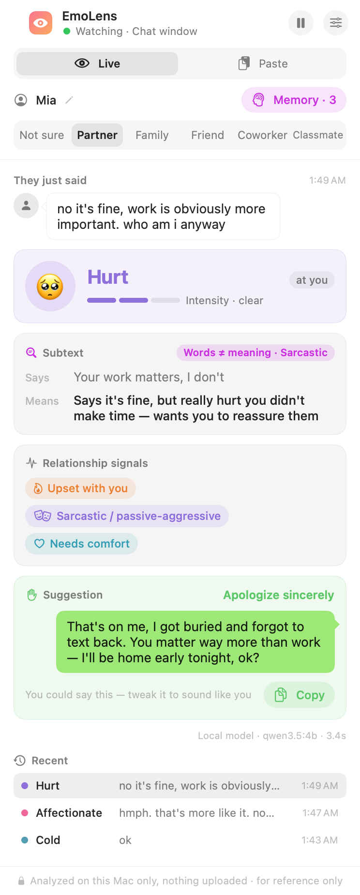
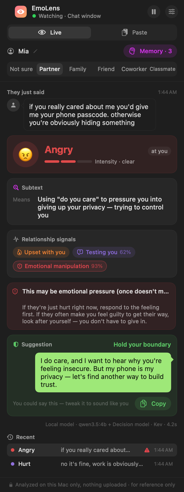
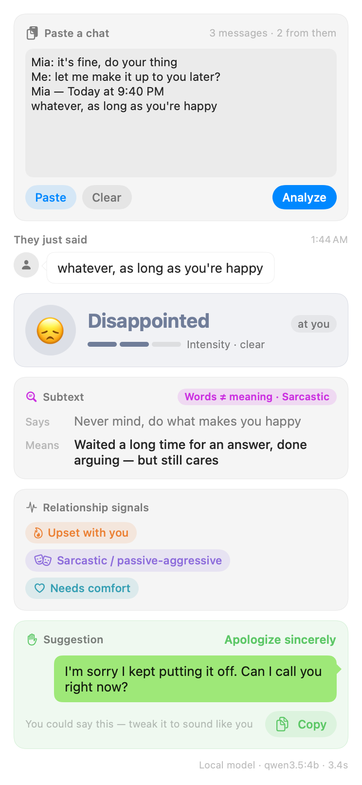
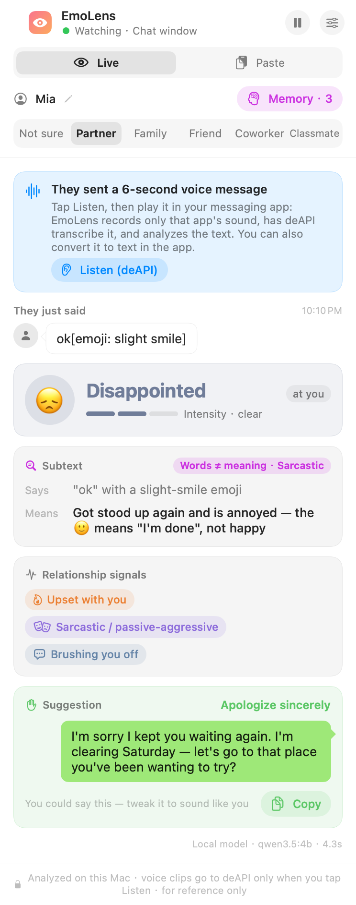
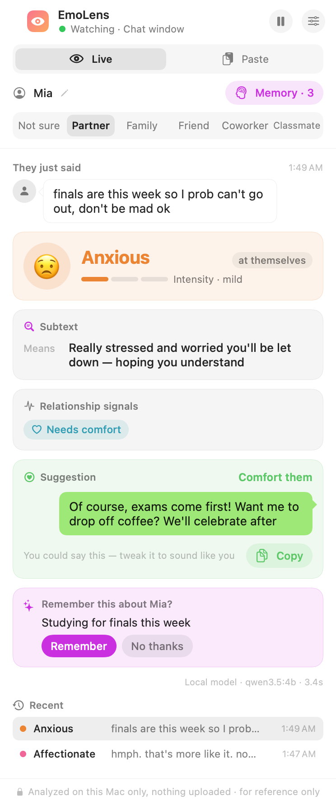
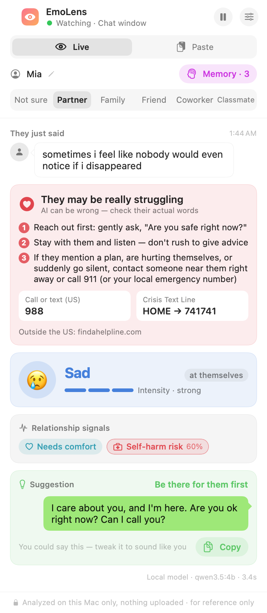

# EmoLens

**Read the subtext in "no it's fine, whatever."**

**[▶ Watch the 3-minute demo](https://youtu.be/ymP04A_ECEM)** · [Download for Mac](https://github.com/timothyzhbw-jpg/emolens/releases/latest) · [中文说明](README.zh-CN.md) · [LovHack Season 3 submission notes](docs/LOVHACK.md)

EmoLens is an open-source macOS floating panel that watches your messaging app's chat window, the way a screen share would. It reads the other person's latest message and tells you:

- **How they feel**: the emotion, how strong it is, and who it's aimed at
- **Whether they mean it**: sincere, **sarcastic**, **playful sulking**, or **holding back**
- **Relationship signals**: upset with you, brushing you off, needs comfort, testing you, pulling away, a fight or breakup signal, **emotional manipulation**, **self-harm risk**, **requests for money or account codes**
- **How to respond**, plus one line you could actually send
- **Who they are to you**: it recognizes who you're talking to and remembers what you noted ("interview next Wednesday", "hates being called dramatic"), so the read fits your relationship

<p align="center">
  
  
</p>

> By default, screen capture, text recognition and analysis all happen **on your Mac** (local Ollama model). No chat content is uploaded. You can opt into cloud models such as **OpenAI, Claude, DeepSeek or Qwen** for sharper reads of subtext; then their message and roughly the last 10 messages go to the provider you chose, and the panel says so the whole time. Voice messages can optionally be transcribed by [deAPI](https://deapi.ai): only the clip you choose to play, only when you tap Listen.
>
> EmoLens doesn't plug into any messaging app's protocol, inject anything, or send messages. It only reads the screen, so it can't get your account banned.

```
chat window ──ScreenCaptureKit──▶ Apple Vision OCR ──▶ bubbles left = them, right = me
      ──▶ new message from them? ──▶ model on your Mac ──▶ floating panel
```

The app is fully bilingual. **English and 中文** cover the interface, the analysis prompts, the keyword safety nets and the crisis resources. It follows your Mac's language and you can switch in Settings.

## Quick start

You need macOS 14 or later. For local analysis you also need [Ollama](https://ollama.com) (skip it if you only use cloud models).

### Build from source

You need Xcode or the Command Line Tools (Swift 5.10+).

```bash
ollama pull qwen3.5:4b          # default local model, ~3.4 GB (skip if cloud-only)
git clone https://github.com/timothyzhbw-jpg/emolens.git && cd emolens
./scripts/build_app.sh          # produces build/EmoLens.app
open build/EmoLens.app
```

**Recommended one-time step (about 1 minute): create a local signing certificate.** In Keychain Access, go to Certificate Assistant → Create a Certificate…, name it `EmoLens Local`, set Identity Type to "Self-Signed Root" and Certificate Type to "Code Signing". `build_app.sh` uses it when it exists. Without it the build is ad-hoc signed, and **macOS treats every rebuild as a new app and asks for Screen Recording permission again**.

### Download

Pre-built DMGs are on the [Releases](https://github.com/timothyzhbw-jpg/emolens/releases/latest) page; drag **EmoLens** into Applications. The English version needs release 0.6.0 or later, and listening to voice messages with deAPI needs 0.7.0 or later. EmoLens is a personal open-source project without a paid Apple Developer ID, so **macOS blocks the first launch** ("can't verify the developer"). Click Done, then open System Settings → Privacy & Security and click "Open Anyway" at the bottom. Or run once: `xattr -dr com.apple.quarantine /Applications/EmoLens.app`.

### First run

1. Allow **EmoLens** in System Settings → Privacy & Security → Screen & System Audio Recording, then reopen the app.
2. Click the sliders icon at the top right, and on the window screenshot **drag a box around just the column of message bubbles** (not the conversation list or the input box).
3. Pick your relationship on the panel: partner, family, friend, coworker or classmate. The same words mean different things in different relationships.

There's no need to start Ollama in Terminal first. **EmoLens starts it for you** (local addresses only; you can turn this off) and warms the model up in the background. If the local model can't start, it tells you so. **It never switches to a cloud model on its own**; whether your chats leave your Mac is always your call.

Don't want to test with a real chat? Run the demo chat window. It "receives" a new message every 15 seconds:

```bash
swift run EmoLensDemo --language en
```

Then set "Window to watch" to EmoLensDemo in EmoLens's settings.

## Two ways to use it

<p align="center"></p>

Switch at the top of the panel:

- **Live**: watches the chat window and analyzes as soon as they send something.
- **Paste**: copy a few messages from any messaging app, paste them in, and click Analyze. No screen capture, no Screen Recording permission, no app needs to be open. Works for screenshots you transcribed from your phone or a chat someone forwarded you. It understands `Mia: message`, `Mia — Today at 9:41 PM` on its own line, and exports with timestamps like `[10/3/26, 9:41 PM] Mia: message`. Lines without a name count as theirs, and if several people appear you can pick who "they" are.

## Emoji, stickers and voice messages

People don't only type. Besides reading the text, EmoLens finds each bubble, sticker and avatar in the screenshot's pixels, so it also understands:

| They sent | EmoLens sees |
|---|---|
| Text with an emoji: "ok 🙂" | `ok [emoji: slight smile]`. It paints the emoji out before OCR (letters next to emoji are the most misread), then crops and enlarges the emoji and asks the model what it is |
| Just an emoji or a sticker | `[sticker: cat covering its ears, text says "not listening"]`. Before, these had no text for OCR and were missed entirely |
| A voice message, already transcribed | `[voice-to-text] so what time are you coming home`. It's analyzed as text, and the model is told it came from speech and may have typos |
| A voice message, not transcribed | The panel says "They sent a 6-second voice message". Convert it to text in your messaging app and analysis continues automatically, or, with [deAPI](#voice-messages-with-deapi) on, tap **Listen** and play it |
| A quoted reply | `what time (replying to: Me: working late)`. The quote isn't mistaken for a new message |

Emoji carry their own social rules: 🙂 after being stood up is usually "I'm done", not happiness; 💀 and 😭 usually mean laughing hard. When a chat contains emoji or voice messages, a short note about these conventions is attached for the model; plain-text chats get exactly the same prompt as before.

### Voice messages with deAPI

<p align="center"></p>

EmoLens reads the screen, so it can't hear a voice message on its own. In Settings, turn on **Listen to voice messages with deAPI (cloud)** and paste a [deAPI](https://deapi.ai) API key (it's stored in the Keychain). When they send an untranscribed voice message:

1. Tap **Listen (deAPI)** on the panel, then play the message in your messaging app.
2. EmoLens records **only that app's audio** with ScreenCaptureKit (not your microphone, not other apps, not EmoLens itself), and stops on its own a few seconds after the message's length, or when you tap Done.
3. The clip is sent to deAPI's OpenAI-compatible `POST /v1/audio/transcriptions` endpoint and transcribed by **Whisper Large V3** (about 6 seconds for a short message in our tests; deAPI lists it at about $0.05 per hour of audio). The recording is deleted right after.
4. The transcript joins the chat as `[voice-to-text] …` and is analyzed like any other message, by whichever analysis model you chose (the local one by default).

Nothing is sent to deAPI unless you tap Listen, and silence is never uploaded. The **Test deAPI** button in Settings checks the key and model without sending any audio.

Debug recognition with `EmoLens --inspect screenshot.png [--analyze] --language en`. It prints the OCR result, the detected bubbles and the assembled messages. Screenshots never leave your Mac.

## Contact memory

<p align="center"></p>

EmoLens reads the name at the top of the chat window to recognize who you're talking to (fix it on the panel if it's wrong) and keeps, for each person:

- **Things you noted**: life updates, likes, sore spots, important dates.
- **Things the AI suggests remembering**: when they mention a specific date, plan, health issue or preference ("job interview next Wednesday", "allergic to shellfish"), the panel asks "Remember this?". **Nothing is saved unless you click Remember.**
- **Mood trends**: recent emotions and relationship signals (only the first 40 characters of each message are kept).
- **Their own relationship**: Mia is your partner and your manager is a coworker; it switches as you switch chats.

The memory summary is given to the model as background, with an explicit instruction to go by what they said this time. Memory lives only in `~/Library/Application Support/EmoLens/memory.json` (readable only by you). You can delete it per person or all at once, or turn off "Use contact memory" and "Record each analysis" in Settings. With a cloud model, the current contact's memory summary is sent along with each analysis.

## Analysis engines

| Language model source | Notes |
|---|---|
| **Local Ollama** (default) | `qwen3.5:4b`. Data never leaves your Mac, and it's free. A 4B model occasionally misreads complex situations |
| **OpenAI-compatible** | OpenAI (default `gpt-5.5`), DeepSeek, Qwen, OpenRouter, or any OpenAI-compatible endpoint |
| **Anthropic Claude** | Native Messages API with structured outputs; default `claude-opus-5`, also `claude-sonnet-5`, `claude-haiku-4-5` |

Speech-to-text for voice messages is separate and optional: [deAPI](#voice-messages-with-deapi) (Whisper Large V3).

- Cloud models are constrained with **structured outputs** (JSON Schema); compatible services without schema support fall back to JSON mode.
- API keys are stored only in the macOS Keychain, never in config files or logs.
- Cloud models bill per request (one per analyzed message). Check your provider's pricing.

You can add a **decision model** (System One): either [Kev](https://github.com/jaredpalmer/kev), which runs locally, or TypeSafe's hosted [Jev](https://docs.typesafe.ai/api). It doesn't write text. It returns calibrated probabilities for each question. In **dual-engine** mode it double-checks the serious signals (upset with you, fight, manipulation, self-harm, money) in parallel and EmoLens keeps the higher score.

### Keyword safety nets

Two keyword nets work with every engine, because small models miss things that matter most:

- **Crisis language**: methods, plans, goodbyes, self-harm, and passive thoughts ("I'm just a burden", "everyone would be better off if I wasn't around", "I just want it all to stop"). Everyday hyperbole like "I'm dead 💀", "kill me now" or "I could die of embarrassment" is deliberately **not** flagged. When it fires, the panel hides the "manipulation" label (labeling someone who says "I'm a burden" as manipulative is harmful) and shows crisis resources: **988** (call or text, US), **Crisis Text Line** (text HOME to 741741), and [findahelpline.com](https://findahelpline.com) elsewhere.
- **Money or account requests**: loans, transfers, card numbers, one-time codes, gift cards. Hacked accounts posing as friends are the most common scam, and models often miss it. The suggestion switches to "call them or check in person first". Asking to see your phone is a boundary issue, not a scam; that's left to the manipulation check.

"Emotional manipulation" can be a false positive (a single "I guess I don't matter" is often hurt, not manipulation), so the wording stays harmless if it's wrong. Only when contact memory shows it repeatedly over 14 days does the panel say so plainly.

## Evaluation

| Set | What's in it |
|---|---|
| [`eval/en.jsonl`](eval/en.jsonl) | 45 hand-written English chats with expected labels: crisis messages, hyperbole that must **not** be flagged, manipulation vs. ordinary hurt, sarcasm, playful sulking, holding back, cold replies, breakup signals, impersonation scams, normal chat, and things worth remembering. None overlap with the prompt's examples |
| Chinese set (44 items) | Measured with `qwen3.5:4b`: emotion 64% (26% if you always guess the most common), self-harm 5/5 with no false positives, manipulation 3–5/5 across repeated runs (the small model samples with some randomness); sarcasm is the weakest at 2–3/5. Details in the [Chinese README](README.zh-CN.md) |

**Full pipeline on the English set** (local `qwen3.5:4b` on an Apple-silicon Mac, Oct 3, 2026, one run):

| Check | Result |
|---|---|
| Emotion category | 29/38 (76%) |
| Signals that must stay **off** (hyperbole, ordinary hurt, normal chat) | 22/22: no false positives |
| Signals that must be raised | 16/24 (67%): self-harm 5/6, money or account codes 3/3, upset with you 2/2, fight or breakup 2/2, needs comfort 2/2, manipulation 2/5, pulling away 0/3, brushing you off 0/1 |
| Literal vs. real meaning (sarcastic, playful, holding back) | 8/13 (62%); sarcasm items fully right 2/5 |

The small local model is cautious: it raised nothing it shouldn't, but it misses the quieter signals, such as cold, distant replies and manipulation dressed up as affection. Those are the cases where a cloud model or the decision-model double-check helps. The keyword nets alone (no model) catch 5/6 crisis messages and 3/3 scams; they were written alongside this set, so treat that part as a sanity check, not a benchmark. Run it yourself:

```bash
swift run EmoLens --eval eval/en.jsonl results.jsonl --language en
python3 scripts/score_eval.py eval/en.jsonl results.jsonl
```

### Testing other Englishes with Adaption Labs

`eval/en.jsonl` is written in American English, but sarcasm and politeness differ a lot between British, Australian, Indian and Canadian English. [`scripts/adaption_localize_eval.py`](scripts/adaption_localize_eval.py) uses the [Adaption Labs](https://adaptionlabs.ai) Adaptive Data API to **localize** every chat into those variants. It rewrites them in local idiom rather than just translating, keeps the expected labels, and writes `eval/en.localized.jsonl` for the same scorer. It only uploads the fictional eval chats, never real conversations or contact memory.

```bash
pip install adaption && export ADAPTION_API_KEY=...
python3 scripts/adaption_localize_eval.py estimate          # quote the credit cost, spends nothing
python3 scripts/adaption_localize_eval.py run --countries GB AU IN CA
swift run EmoLens --eval eval/en.localized.jsonl localized.jsonl --language en
python3 scripts/score_eval.py eval/en.localized.jsonl localized.jsonl
```

## Customizing

Questions and prompts live in `presets/`. Edit the JSON; no recompiling needed (rebuild the .app, or point `EMOLENS_PRESETS` at your folder):

- `emotion.llm.en.json` / `emotion.llm.zh.json`: system prompt and few-shot examples for the language model. `media_note` is only attached when a chat contains emoji or voice
- `emotion.en.json` / `emotion.zh.json`: System One questions for the decision model
- `emotion.schema.en.json` / `emotion.schema.json`: JSON Schema for cloud structured outputs

The English model answers with English labels (`sarcastic`, `hurt`, `hold boundary`); EmoLens maps them to the same internal labels as the Chinese version, so colors, memory and history work the same in both languages.

## Limitations

- **It only sees what's on screen.** Voice messages need to be transcribed in your messaging app first, or played while EmoLens listens with deAPI turned on. Videos, files and link cards are read by their visible text. Bubble, avatar and name detection follows common chat layouts and can occasionally misread a different app, theme or font size.
- **Small models aren't always right about emoji.** 😂 might come back as "laughing sweating". Stickers with text are read most reliably.
- **It analyzes only their latest message**, with about the last 10 messages as context.
- **Contact names come from the title bar.** Draw the chat area just below the name. If it's wrong, click the pencil on the panel.
- **Models make mistakes**, especially a 4B one, and the same message can get different reads twice. Weigh the result against their actual words and what you know about them.
- It works with chat layouts where their messages are on the left and yours on the right. Apps that left-align everyone, like most team chat tools, aren't supported.

<p align="center"></p>

## Using it responsibly

- **This is not a diagnostic tool**, and it doesn't replace talking honestly with someone.
- Chats contain other people's private lives. Memory stays on your Mac and can be deleted any time; please don't use EmoLens to monitor anyone. Before choosing a cloud model, decide whether you're comfortable sending this content to that provider.
- If you see **Self-harm risk**: gently ask if they're safe right now, and stay with them. If they mention a plan, are hurting themselves, or go silent, contact someone near them or call **911** (or your local emergency number). In the US, call or text **988**; text **HOME to 741741** for the Crisis Text Line; elsewhere see [findahelpline.com](https://findahelpline.com).
- If you see **Emotional manipulation**: your feelings are real. You can hold your boundary kindly and firmly, and reach out to someone you trust.

## Development

```bash
swift build          # build
swift test           # unit tests: bubble parsing, new-message detection, engines, safety nets, English pipeline
swift run EmoLens --language en    # run directly (Screen Recording permission is granted to your terminal)
./scripts/make_dmg.sh              # build a universal DMG for release
```

```
Sources/EmoLensCore/   pure logic: OCR lines → messages, new-message detection, engines, safety nets, languages
Sources/EmoLens/       macOS app: capture, OCR, floating panel, settings
Sources/EmoLensDemo/   demo chat window
presets/               prompts and question sets (English and Chinese)
eval/                  English eval set
scripts/               app/DMG packaging, eval scorer, Adaption localization
```

Offline tools that don't capture the screen or open windows (add `--language en` for English):

- `EmoLens --inspect chat.png [--analyze]`: run recognition on one screenshot
- `EmoLens --replay 1.png 2.png …`: replay screenshots through the exact monitoring pipeline
- `EmoLens --render-previews docs/screenshots`: render every UI state (light and dark) with fictional sample data. CI does this on every push and uploads the PNGs as an artifact

Set `EMOLENS_LOG=/path/reports.jsonl` to append every result to a file, and `EMOLENS_MEMORY=/path/memory.json` to keep tests away from your real memory. Runtime log: `log stream --predicate 'subsystem == "io.github.emolens"'` (message text is marked private and never appears in plain text).

## Credits

- [Kev](https://github.com/jaredpalmer/kev): open-weights System One decision model
- [Ollama](https://ollama.com) and [Qwen](https://github.com/QwenLM)
- [Adaption Labs](https://adaptionlabs.ai): Adaptive Data API used to localize the English eval set
- [deAPI](https://deapi.ai): Whisper Large V3 transcription for voice messages
- Built with Claude; OpenAI Codex implemented the bubble parser and new-message detection; Grok reviewed the emotion dimensions and prompts.

## License

[Apache License 2.0](LICENSE)
